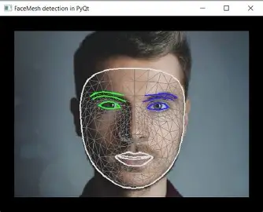
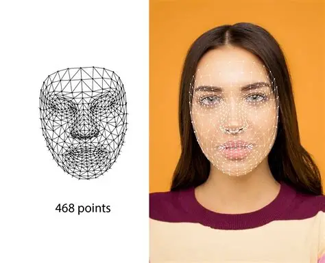
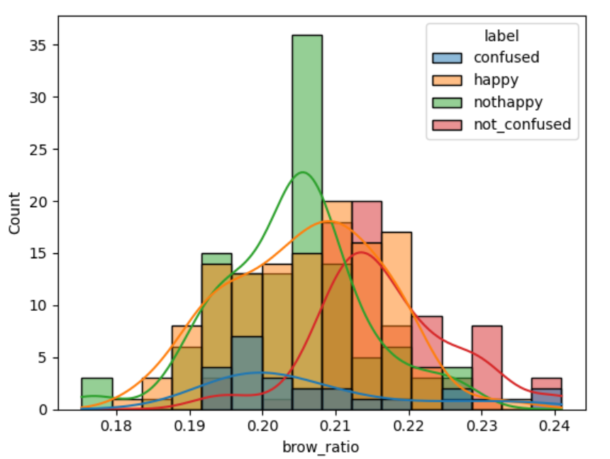

# SmartSession

SmartSession is a real-time classroom monitoring assessment system that leverages computer vision to analyze student engagement and focus. It provides immediate feedback to students and live telemetry to teachers, enabling a more interactive and responsive learning environment.

## Visuals

### FaceMesh Technology
The application utilizes advanced 468-point FaceMesh technology for precise detection of gaze and emotion.
- So, this new kind of thing for me, as I had experienced computer object detection using Yolov5, but this is a bit new.
- Here is my entire logic since the mesh account for the 468 poinst the only better way to determine is to find the distance b/w these points and map it to a different kind of emotion's state. This whole process is in the notebook section
- This is a mix of both hardcoded and ML logic, as I custom-trained a classifier to map the values to the emotional state my traning the pics of different emotions and  making the classifier pick the difference b/w different sets of points, and it distinguished the parameters to certain classes.
- I then had my Hardcoded cases to bypass certain distinctions, as for this type of cases there is no perfect dataset.
- ## Result:
- Fully duplex real-time emotion detection updation with real estimation of the student by a very good margin.
 




.png)

## Architectural Approach

The application is built on a **Client-Server architecture** utilizing **WebSockets** for low-latency, real-time communication.

### Core Components

1.  **Frontend (React + Vite)**:
    - **Student Portal**: Captures webcam video streams and sends frames to the server via WebSockets. It receives instant feedback on the student's state (e.g., Focused, Distracted).
    - **Teacher Dashboard**: Connects to the server to receive aggregated, real-time telemetry of all students in the session.
    - **Styling**: Built with **TailwindCSS** for a modern, responsive UI.

2.  **Backend (FastAPI)**:
    - **WebSocket Manager**: Handles multiple concurrent connections (Students and Teachers) and routes messages efficiently.
    - **Computer Vision Pipeline**: Uses **OpenCV** and **MediaPipe** to analyze incoming video frames for:
        - Face Detection
        - Gaze Estimation
        - Emotion/Engagement Scoring
    - **Logic**: Determines the student's state (Focused, Happy, Confused, Distracted) based on the analysis and braodcasts updates.

### Data Flow
1.  **Capture**: Browser captures video frame.
2.  **Transmission**: Frame sent as base64 string over WebSocket to `/ws/student/{id}`.
3.  **Processing**: Server decodes image -> MediaPipe checks landmarks -> Logic calculates "Engagement Score".
4.  **Feedback**: Server sends result back to the specific Student client.
5.  **Monitoring**: Server broadcasts the student's status object to all connected Teacher clients via `/ws/teacher/{class_id}`.

---

## Tech Stack

- **Backend**: Python 3.x, FastAPI, Uvicorn, WebSockets, OpenCV, MediaPipe, NumPy.
- **Frontend**: React, Vite, TailwindCSS, Lucide-React.

---

## How to Run

### Prerequisites
- Python 3.8+
- Node.js & npm

### 1. Backend Setup

Navigate to the root directory.

```bash
# Create a virtual environment
python -m venv venv

# Activate the virtual environment
# Windows:
venv\Scripts\activate
# macOS/Linux:
# source venv/bin/activate

# Install dependencies
pip install -r requirements.txt
```

**Start the Server:**

```bash
uvicorn app.api.main:app --reload
```
The backend will run at `http://127.0.0.1:8000`.

### 2. Frontend Setup

Open a new terminal and navigate to the `frontend` directory.

```bash
cd frontend

# Install dependencies
npm install

# Start the development server
npm run dev
```

The frontend will usually run at `http://127.0.0.1:5173`.

## Features

- **Real-time Engagement Tracking**: Detects if a student is looking away, confused, or happy.
- **Privacy-Focused**: Images are processed in memory and not stored.
- **Live Teacher Dashboard**: View grid of student statuses.
- **Instant Student Feedback**: Visual cues for students to improve focus.

## Future developments
- Want to implement An Ai enabled telepromt reader, as in this analyses the lectureis analyzed  and then determined via polling in which segment of the lecture the student lost interest in class.
- Updated UI frontend: Due to time constrint couldnot do much but have to do a better job :)


